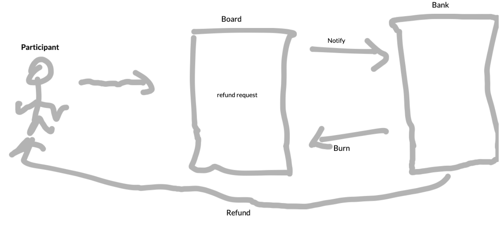

#      Initial NFT Offerings

## essodong@pm.me 
## hello@chronchain.io

## Friday 12 March 2021

#### Abstract

Tokenomics have long played a big role in the success or failure of token-based companies.
And it drives some companies to be more focused on token design than the shipment of the product or the value creation of the company. And sometimes participants abandon the projects or the companies fail to deliver.

We believe INO or Initial NFT Offering can help protect the interest and incentivize tokensale participants.

## 1- The Dilemma 

Crowdsale is seen as purely speculative and a money-making opportunity and this has a lot to do with participants putting their funds in “New Ultimate Gem“ without any will of collaboration or basic knowledge of the project.
Instead, they are wishing that the $0.01 token goes to $1 in a matter of days and don’t care about the delivery or the technology in the building.
This kind of pressure, unfortunately, drives some companies to over-promise and deliver poor products or worse to not deliver at all.

## 2- The Proposal

As tokensale participants have different expectations, we are proposing an adaptative mintable token contract.
The contract will follow an ERC721 standard with rules, participants can add or remove before minting the token against their funds to ensure that the company will follow their roadmap and will deliver.

/* A non-fungible token with metadata to increase or decrease your incentives according to the participant behavior like feedback on the products, inviting new adopters, and collaborating with the project team. 
/*

Incentives for INO participation can be : 

    Informative :
    an NFT holder will have information about any modification or update of the company roadmap before those information going public.

    governmental :
    an NFT holder will have full governance points for voting or governance proposals.

    Airdropping :
    an NFT holder will receive airdrop tokens every week.

    Refundable :
    an NFT holder can receive a verifiable claim for refunds.

## 3- The Scenario 

  Bob has purchased an NFT, Bob is happy with the company's behavior => Bob will give his feedback to the company => Bob will be granted more governance points.

  Alicia has purchased an NFT, Alicia is not happy with the company suddenly changing the project roadmap => Alicia gives her feedback to the company and can call the function of the refund => Alicia will be refunded.

